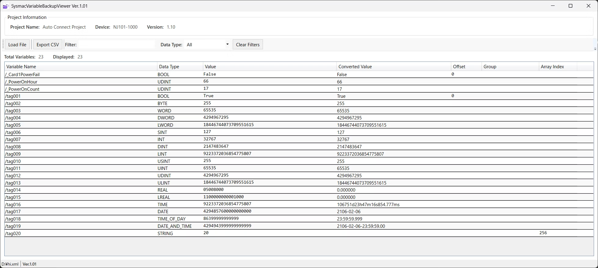

# SysmacVariableBackupViewer

[English](#english) | [日本語](#japanese)



---

## English

### Overview

SysmacVariableBackupViewer is a Windows desktop application for viewing and analyzing Sysmac Studio XML backup files. It provides a user-friendly interface to display variable data with advanced filtering and export capabilities.

### Key Features

- **XML Backup File Parsing**: Load and parse Sysmac Studio XML backup files
- **Variable Data Display**: View variable information in a structured table format
- **Data Type Conversion**: Automatic conversion of various PLC data types (hex, date/time, floating point, etc.)
- **Advanced Filtering**: Real-time text search and data type filtering
- **CSV Export**: Export filtered data to CSV format
- **High Performance**: Optimized for large datasets with caching and virtualization
- **About Window**: Display application information, system details, and license information

### Supported Data Types

- **Basic Types**: BOOL, WORD, UINT, INT
- **Floating Point**: REAL, LREAL
- **String Types**: STRING
- **Date/Time**: DATE_AND_TIME, TIME, DATE, TIME_OF_DAY

### System Requirements

- Windows 10 or later
- .NET 6.0 Runtime
- Minimum 4GB RAM recommended
- 100MB free disk space

### Usage

1. **Launch Application**: Run `SysmacVariableBackupViewer.exe`
2. **Load File**: Click "Load File" button and select XML backup file
3. **View Data**: Variable information is displayed in the main table
4. **Filter Data**: Use text search and data type filters
5. **Export**: Click "Export CSV" to save filtered data
6. **About**: Access Help menu → About for application information

### Displayed Information

| Column | Description |
|--------|-------------|
| Variable Name | Variable name with hierarchical structure |
| Data Type | Data type |
| Value | Original value from XML |
| Converted Value | Human-readable converted value |
| Offset | Memory offset |
| Group | Group name (first part of hierarchy) |
| Array Index | Array index (for array variables) |

### Technical Specifications

- **Framework**: .NET 6.0 WPF
- **Architecture**: MVVM pattern
- **Deployment**: Single-file executable
- **Optimization**: ReadyToRun compilation, trimming enabled
- **Memory Management**: Efficient caching and garbage collection

### Build Instructions

```bash
# Clone repository
git clone https://github.com/fa-yoshinobu/SysmacVariableBackupViewer.git

# Navigate to project directory
cd SysmacVariableBackupViewer/SysmacXmlViewer

# Build application
dotnet build

# Publish single-file executable
dotnet publish -c Release -r win-x64 --self-contained true /p:PublishSingleFile=true
```

### Project Structure

```
SysmacVariableBackupViewer/
├── SysmacXmlViewer/
│   ├── Models/          # Data models
│   ├── ViewModels/      # MVVM view models
│   ├── Views/           # WPF user interfaces
│   ├── Services/        # Business logic services
│   └── Commands/        # Command implementations
├── README.md
├── CHANGELOG.md
└── LICENSE.txt
```

### License

This software is provided "as is" without warranty. See LICENSE.txt for details.

### Author

- **Author**: fa-yoshinobu
- **GitHub**: https://github.com/fa-yoshinobu/SysmacVariableBackupViewer

---

## Japanese

### 概要


SysmacVariableBackupViewerは、Sysmac StudioのXMLバックアップファイルを表示・分析するためのWindowsデスクトップアプリケーションです。高度なフィルタリング機能とエクスポート機能を備えた、使いやすいインターフェースで変数データを表示します。

### 主な機能

- **XMLバックアップファイル解析**: Sysmac StudioのXMLバックアップファイルの読み込みと解析
- **変数データ表示**: 構造化されたテーブル形式での変数情報表示
- **データ型変換**: 各種PLCデータ型（16進数、日時、浮動小数点など）の自動変換
- **高度なフィルタリング**: リアルタイムテキスト検索とデータ型フィルタリング
- **CSVエクスポート**: フィルタリングされたデータのCSV形式での出力
- **高性能**: キャッシュと仮想化による大規模データセットの最適化
- **Aboutウィンドウ**: アプリケーション情報、システム詳細、ライセンス情報の表示

### 対応データ型

- **基本型**: BOOL, WORD, UINT, INT
- **浮動小数点**: REAL, LREAL
- **文字列型**: STRING
- **日時型**: DATE_AND_TIME, TIME, DATE, TIME_OF_DAY

### システム要件

- Windows 10以降
- .NET 6.0 Runtime
- 推奨メモリ: 4GB以上
- 空き容量: 100MB以上

### 使用方法

1. **アプリケーション起動**: `SysmacVariableBackupViewer.exe`を実行
2. **ファイル読み込み**: 「Load File」ボタンをクリックしてXMLバックアップファイルを選択
3. **データ表示**: メインテーブルに変数情報が表示されます
4. **データフィルタリング**: テキスト検索とデータ型フィルタを使用
5. **エクスポート**: 「Export CSV」をクリックしてフィルタリングされたデータを保存
6. **About**: ヘルプメニュー→Aboutでアプリケーション情報を確認

### 表示される情報

| 列名 | 説明 |
|------|------|
| Variable Name | 階層構造を含む変数名 |
| Data Type | データ型|
| Value | XMLから読み込んだ元の値 |
| Converted Value | 人間が読みやすい変換後の値 |
| Offset | メモリオフセット |
| Group | グループ名（階層の最初の部分） |
| Array Index | 配列インデックス（配列の場合） |

### 技術仕様

- **フレームワーク**: .NET 6.0 WPF
- **アーキテクチャ**: MVVMパターン
- **配布形式**: 単一ファイル実行形式
- **最適化**: ReadyToRunコンパイル、トリミング有効
- **メモリ管理**: 効率的なキャッシュとガベージコレクション

### ビルド手順

```bash
# リポジトリをクローン
git clone https://github.com/fa-yoshinobu/SysmacVariableBackupViewer.git

# プロジェクトディレクトリに移動
cd SysmacVariableBackupViewer/SysmacXmlViewer

# アプリケーションをビルド
dotnet build

# 単一ファイル実行形式で公開
dotnet publish -c Release -r win-x64 --self-contained true /p:PublishSingleFile=true
```

### プロジェクト構造

```
SysmacVariableBackupViewer/
├── SysmacXmlViewer/
│   ├── Models/          # データモデル
│   ├── ViewModels/      # MVVMビューモデル
│   ├── Views/           # WPFユーザーインターフェース
│   ├── Services/        # ビジネスロジックサービス
│   └── Commands/        # コマンド実装
├── README.md
├── CHANGELOG.md
└── LICENSE.txt
```

### ライセンス

本ソフトウェアは「現状のまま」提供され、保証はありません。詳細はLICENSE.txtを参照してください。

### 作者

- **作者**: fa-yoshinobu
- **GitHub**: https://github.com/fa-yoshinobu/SysmacVariableBackupViewer
