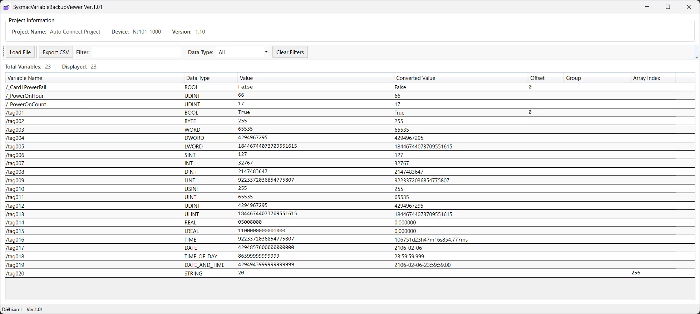

# SysmacVariableBackupViewer

[](https://github.com/fa-yoshinobu/SysmacVariableBackupViewer/releases/latest)
[](https://github.com/fa-yoshinobu/SysmacVariableBackupViewer/actions/workflows/ci.yml)
[](https://github.com/fa-yoshinobu/SysmacVariableBackupViewer/actions/workflows/ci.yml)
[](https://github.com/fa-yoshinobu/SysmacVariableBackupViewer/actions/workflows/release.yml)
[](https://github.com/fa-yoshinobu/SysmacVariableBackupViewer/blob/main/SysmacXmlViewer/LICENSE.txt)
[](https://dotnet.microsoft.com/download/dotnet/8.0)

[譌･譛ｬ隱枉(#japanese) | [English](#english)



## Japanese

### 讎りｦ・
SysmacVariableBackupViewer 縺ｯ縲ヾysmac Studio 縺ｮ XML 繝舌ャ繧ｯ繧｢繝・・繝輔ぃ繧､繝ｫ繧定｡ｨ遉ｺ繝ｻ遒ｺ隱阪☆繧九◆繧√・ Windows 繝・せ繧ｯ繝医ャ繝励い繝励Μ縺ｧ縺吶€ょ､画焚荳€隕ｧ縺ｮ蜿ら・縲√ョ繝ｼ繧ｿ蝙句､画鋤縲∫ｵ槭ｊ霎ｼ縺ｿ縲，SV 繧ｨ繧ｯ繧ｹ繝昴・繝医ｒ陦後∴縺ｾ縺吶€・
### 荳ｻ縺ｪ讖溯・

- XML 繝舌ャ繧ｯ繧｢繝・・繝輔ぃ繧､繝ｫ縺ｮ隱ｭ縺ｿ霎ｼ縺ｿ縺ｨ隗｣譫・- 螟画焚荳€隕ｧ縺ｮ陦ｨ蠖｢蠑剰｡ｨ遉ｺ
- PLC 繝・・繧ｿ蝙九・閾ｪ蜍募､画鋤
- 繝・く繧ｹ繝域､懃ｴ｢縺ｨ繝・・繧ｿ蝙九ヵ繧｣繝ｫ繧ｿ繝ｼ
- CSV 繧ｨ繧ｯ繧ｹ繝昴・繝・- 蜊倅ｸ€ `exe` 驟榊ｸ・
### 蜍穂ｽ懃腸蠅・
- Windows 10 莉･髯・- .NET 8 Desktop Runtime
- 4GB RAM 莉･荳翫ｒ謗ｨ螂ｨ

### CI / Release 閾ｪ蜍募喧

- `CI` workflow
  - `dotnet format whitespace --verify-no-changes`
  - `dotnet build -c Release /warnaserror`
  - .NET analyzer 縺ｮ minimum 繝ｫ繝ｼ繝ｫ繧貞ｮ溯｡後＠縲∵里蟄倥・荳€驛ｨ CA 繝ｫ繝ｼ繝ｫ縺ｯ隴ｦ蜻翫→縺励※蜃ｺ蜉・  - 蜊倅ｸ€ `exe` publish 縺ｮ繧ｹ繝｢繝ｼ繧ｯ繝・せ繝・- `Release` workflow
  - `v*` 繧ｿ繧ｰ push 縺ｧ GitHub Release 繧定・蜍穂ｽ懈・
  - `SysmacVariableBackupViewer-<version>-win-x64.exe` 繧定・蜍墓ｷｻ莉・  - `sha256` 繝輔ぃ繧､繝ｫ繧ょ酔譎ら函謌・
### 繝ｭ繝ｼ繧ｫ繝ｫ繝薙Ν繝・
```powershell
git clone https://github.com/fa-yoshinobu/SysmacVariableBackupViewer.git
cd SysmacVariableBackupViewer\SysmacXmlViewer
dotnet publish -c Release -r win-x64 --self-contained true -p:PublishSingleFile=true
```

蜃ｺ蜉帛・:

```text
SysmacXmlViewer\bin\Release\net8.0-windows\win-x64\publish\SysmacVariableBackupViewer.exe
```

### 繝ｪ繝ｪ繝ｼ繧ｹ謇矩・
```powershell
git tag v1.0.5
git push origin v1.0.5
```

繧ｿ繧ｰ繧・push 縺吶ｋ縺ｨ GitHub Actions 縺悟腰荳€ `exe` 繧偵ン繝ｫ繝峨＠縲ヽelease 縺ｫ豺ｻ莉倥＠縺ｾ縺吶€・
### 繝ｩ繧､繧ｻ繝ｳ繧ｹ

縺薙・繝ｪ繝昴ず繝医Μ縺ｯ繧ｫ繧ｹ繧ｿ繝繝ｩ繧､繧ｻ繝ｳ繧ｹ縺ｧ縺吶€りｩｳ邏ｰ縺ｯ [SysmacXmlViewer/LICENSE.txt](SysmacXmlViewer/LICENSE.txt) 繧貞盾辣ｧ縺励※縺上□縺輔＞縲・
## English

### Overview

SysmacVariableBackupViewer is a Windows desktop application for viewing and analyzing Sysmac Studio XML backup files. It provides variable browsing, data type conversion, filtering, and CSV export.

### Key Features

- Parse Sysmac Studio XML backup files
- Display variables in a structured table
- Convert PLC data types into readable values
- Filter by text and data type
- Export filtered rows to CSV
- Ship as a single-file Windows executable

### Requirements

- Windows 10 or later
- .NET 8 Desktop Runtime
- 4 GB RAM recommended

### Automated Quality and Release Flow

- `CI` workflow
  - verifies whitespace formatting with `dotnet format`
  - builds in `Release` with warnings treated as errors
  - runs a minimum .NET analyzer set while leaving selected legacy CA rules as non-blocking warnings
  - smoke-tests single-file publish output
- `Release` workflow
  - runs automatically when a `v*` tag is pushed
  - publishes a single-file `win-x64` executable to GitHub Releases
  - uploads a matching `sha256` checksum file

### Local Build

```powershell
git clone https://github.com/fa-yoshinobu/SysmacVariableBackupViewer.git
cd SysmacVariableBackupViewer\SysmacXmlViewer
dotnet publish -c Release -r win-x64 --self-contained true -p:PublishSingleFile=true
```

### Release

```powershell
git tag v1.0.5
git push origin v1.0.5
```

Pushing the tag triggers GitHub Actions to build the single-file executable and attach it to a GitHub Release.

### License

This repository uses a custom license. See [SysmacXmlViewer/LICENSE.txt](SysmacXmlViewer/LICENSE.txt) for details.

